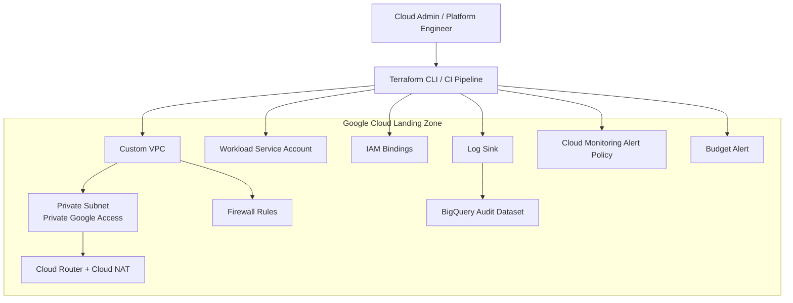

# GCP Secure Landing Zone Terraform

A portofolio-ready Google Cloud landing zone blueprint built with Terraform. This project demonstrates how a Presales / Cloud Architect / Solution Architect can translate enterprise requirements into a deployable cloud foundation with networking, IAM, security baseline, logging, monitoring, and cost governance

---

## 1. Business Problem

Many organizations want to start using Google Cloud, but they often lack a standardized foundation for:

- Secure network segmentation
- Least-privilege access control
- Centralized logging and audit readiness
- Basic monitoring and alerting
- Budget visibility and cost guardrails
- Repeatable provisioning using Infrastructure as Code

This project provides a reusable landing zone baseline that can be adapted for development, staging, or production environments

---

## 2. Proposed Solution

The proposed solution provisions a secure Google Cloud foundation with:

- Custom VPC network and subnet
- Private Google Access enabled subnet
- Restricted inbound firewall rules
- Cloud NAT for private workloads to access the internet without public IPs
- Service account for workload identity separation
- IAM bindings using least-privilege roles
- Log sink to BigQuery for audit and operational logs
- Monitoring alert policy for high VM CPU utilization
- Budget alert configuration for cost governance
- Standard labels for ownership and environment tagging

---

## 3. Reference Architecture



---

## 4. Services Used

| Area | Google Cloud Service | Purpose |
|---|---|---|
| Networking | VPC, Subnet, Firewall, Cloud Router, Cloud NAT | Secure network foundation |
| Identity | IAM, Service Account | Access separation and least privilege |
| Logging | Cloud Logging, BigQuery | Centralized audit and operational log storage |
| Monitoring | Cloud Monitoring | Basic alerting baseline |
| Cost | Cloud Billing Budget | Budget threshold notification |
| IaC | Terraform Google Provider | Repeatable provisioning |

---

## 5. Repository Structure

```text
.
├── environments/
│   └── dev/
│       ├── backend.tf
│       ├── main.tf
│       ├── terraform.tfvars.example
│       └── versions.tf
├── modules/
│   ├── budget/
│   ├── iam/
│   ├── logging/
│   ├── monitoring/
│   └── network/
├── docs/
│   ├── architecture.md
│   ├── cost-estimation.md
│   ├── deployment-guide.md
│   ├── security-design.md
│   └── presales-one-pager.md
├── scripts/
│   └── validate.sh
├── .github/
│   └── workflows/
│       └── terraform-check.yml
├── .gitignore
├── LICENSE
└── README.md
```

---

## 6. Prerequisites

- Google Cloud project already created
- Billing account available if using the budget module
- Terraform installed locally or executed through CI/CD
- Google Cloud CLI authenticated locally
- Required APIs can be enabled manually or through this Terraform project

Example authentication:

```bash
gcloud auth application-default login
gcloud config set project YOUR_PROJECT_ID
```

---

## 7. How to Deploy

Copy the example variables file:

```bash
cd environments/dev
cp terraform.tfvars.example terraform.tfvars
```

Edit `terraform.tfvars` and adjust values:

```hcl
project_id         = "gcp-project-id"
region             = "asia-southeast2"
environment        = "dev"
billing_account_id = "000000-000000-000000"
budget_amount      = 50
admin_group_email  = "gcp-admins@example.com"
```

Run Terraform:

```bash
terraform init
terraform fmt -recursive
terraform validate
terraform plan
terraform apply
```

---

## 8. Security Considerations

This landing zone applies these security principles:

- Use custom VPC instead of default VPC
- Avoid broad inbound access by default
- Use Cloud NAT to avoid public IPs for private workloads
- Enable Private Google Access on subnet
- Separate workload identity with dedicated service account
- Apply least-privilege IAM role bindings
- Store logs in BigQuery for audit and investigation
- Use labels for accountability and governance

For deeper detail, see [`docs/security-design.md`](docs/security-design.md)

---

## 9. Cost Considerations

This project is designed as a minimal baseline, but some resources can generate cost, especially Cloud NAT, BigQuery log storage, and log ingestion. For lab usage, always review the Terraform plan and disable optional modules if needed.

See [`docs/cost-estimation.md`](docs/cost-estimation.md)

---

## 10. Presales Positioning

This repository can be used as a presales artifact to show:

- How to convert business pain points into a technical solution
- How to design a secure landing zone baseline
- How to estimate scope, assumptions, and cost drivers
- How to document architecture decisions
- How to prepare a reusable customer proposal foundation

See [`docs/presales-one-pager.md`](docs/presales-one-pager.md)

---

## 11. Future Improvements

- Add organization-level policy module
- Add Shared VPC support
- Add folder and project factory module
- Add Cloud KMS baseline
- Add Security Command Center integration
- Add centralized log sink at organization level
- Add CI/CD deployment using Workload Identity Federation
- Add automated policy checks with Checkov or OPA
