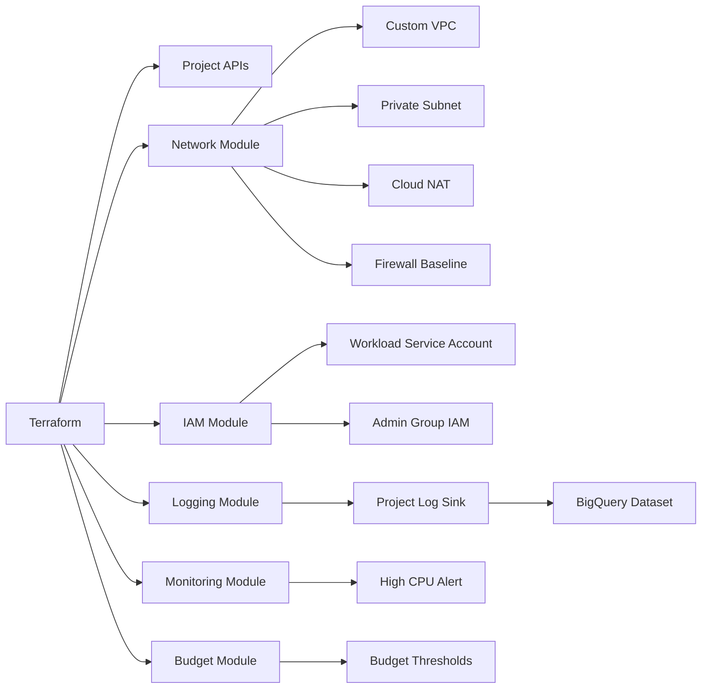

# Design Goals

1. Provide a repeatable Infrastructure as Code baseline
2. Reduce security risk from default network exposure
3. Enable private workload egress using Cloud NAT
4. Centralize relevant audit and error logs
5. Provide basic operational visibility
6. Add simple budget governance

## Logical Architecture

## Architecture Decisions

| Decision | Reason |
|---|---|
| Existing project approach | Easier for lab and portofolio usage without requiring organization/folder access. |
| Custom VPC | Avoids default VPC exposure and supports controlled subnetting. |
| Private Google Access | Lets private resources access Google APIs without external IP dependency. |
| Cloud NAT | Provides outbound internet access without assigning public IPs to workloads. |
| BigQuery log sink | Supports audit analysis and query-based investigation. |
| Budget module | Adds basic cost control for lab and customer demo usage. |

## Limitations

- This is a project-level landing zone, not a full organization-level landing zone
- Organization policies are not included yet
- Shared VPC and folder factory patterns are future enhancements
- Budget notification behavior depends on billing/IAM setup
